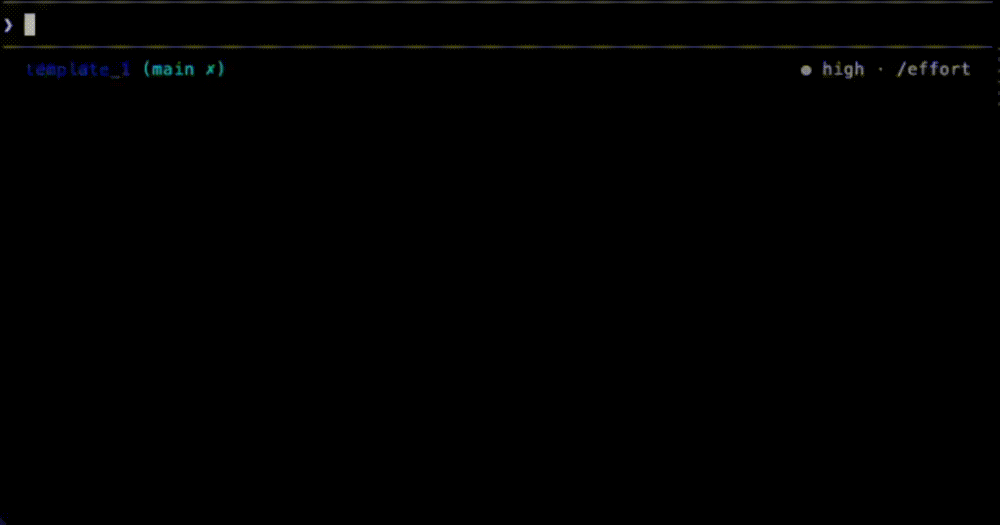

# Prompt Best Practices

An AI agent skill that transforms unstructured prompts into high-quality structured prompts through a short interactive dialogue. Works with any AI agent that supports the [Agent Skills](https://agentskills.io/) open standard.

**First-class support for both Anthropic Claude and OpenAI Codex.** The 7-component framework was built by studying the prompting guidelines published by the major LLM providers. The canonical reference is [Anthropic's prompting best practices](https://platform.claude.com/docs/en/build-with-claude/prompt-engineering/claude-prompting-best-practices) — the most comprehensive publicly available guide on the subject — with each component mapped to a specific section of that documentation. The framework then maps onto [OpenAI's GPT-5.6 model guidance](https://developers.openai.com/api/docs/guides/prompt-guidance-gpt-5p6), and dedicated tuning notes for each runtime live in `skills/prompt-best-practices/references/claude-considerations.md` and `skills/prompt-best-practices/references/codex-considerations.md`. Baselines are current: Claude Fable 5 / Mythos 5 (with Opus 4.8 as the fallback target) and OpenAI GPT-5.6 Sol. Both flagships now reward *leaner* prompts — the framework's job is to make intent precise, not to maximize component count (see `framework.md` > "Calibrating for frontier models"). The underlying principles — clear tasks, structured context, well-motivated constraints — are shared across providers and improve output quality on any LLM.

## The Problem

Most prompts sent to AI agents lack the structure needed to produce reliable, high-quality output. Users provide a vague goal — "write me an email", "build this feature" — without defining success criteria, output format, constraints, or context. The model fills in the blanks with assumptions, and what follows is multiple rounds of corrections to converge on what the user actually wanted.

This skill reduces that cycle. It intercepts underspecified prompts and guides you through a short, tier-adaptive dialogue (up to 2 questions for quick tasks, up to 5 for complex ones) to surface the missing information. The result is a structured prompt sized to the task weight.

## Non-goals

- **Not a guarantee** of better output. The framework encodes well-documented heuristics but makes no empirical claim without a benchmark run. See `tests/benchmark-protocol.md` for how to measure effect size on your workload.
- **Not a generic writing coach.** It skips questions, micro-tasks, and conversational exchanges. See `tests/activation-fixtures.md` for the exact contract.
- **Not XML-only.** Structure is format-agnostic (XML, Markdown, JSON all qualify). XML is the Claude default.
- **Not a framework factory.** The 7 components are the framework. PRs adding new components belong in a fork. See [CONTRIBUTING.md](CONTRIBUTING.md) > Scope and non-goals.

## Demo

<p align="center">
  
</p>

## Installation

One command. No configuration, no dependencies, no setup files to edit.

### Via `skills.sh` (any compatible agent)

```bash
npx skills add gquattromani/prompt-best-practices -g -y
```

### Via Claude Code plugin

```
/plugin marketplace add gquattromani/prompt-best-practices
/plugin install prompt-best-practices@prompt-best-practices
```

This installs the skill globally. It is immediately available in every project, in every agent that supports the [Agent Skills](https://agentskills.io/) standard.

## Usage

```
/prompt-best-practices
```

The skill activates automatically when you ask to write, draft, generate, implement, fix, refactor, or build any output that lacks clear structure. Invoke it explicitly via slash command to force activation on any prompt.

## How It Works

The skill evaluates your prompt against 7 components, each grounded in a specific section of [Anthropic's prompting guide](https://platform.claude.com/docs/en/build-with-claude/prompt-engineering/claude-prompting-best-practices):

| # | Component | What it checks | Source |
|---|---|---|---|
| 1 | **Task** | Clear action with measurable success criteria | [Be clear and direct](https://platform.claude.com/docs/en/build-with-claude/prompt-engineering/claude-prompting-best-practices#be-clear-and-direct) |
| 2 | **Role** | Defined expertise area or persona | [Give a role](https://platform.claude.com/docs/en/build-with-claude/prompt-engineering/claude-prompting-best-practices#give-claude-a-role) |
| 3 | **Context** | Relevant documents or data | [Long context prompting](https://platform.claude.com/docs/en/build-with-claude/prompt-engineering/claude-prompting-best-practices#long-context-prompting) |
| 4 | **Examples** | Concrete examples of desired output | [Use examples effectively](https://platform.claude.com/docs/en/build-with-claude/prompt-engineering/claude-prompting-best-practices#use-examples-effectively) |
| 5 | **Output specification** | Format, tone, audience, anti-patterns | [Control the format of responses](https://platform.claude.com/docs/en/build-with-claude/prompt-engineering/claude-prompting-best-practices#control-the-format-of-responses) |
| 6 | **Constraints** | Rules with motivation (why each exists) | [Add context to improve performance](https://platform.claude.com/docs/en/build-with-claude/prompt-engineering/claude-prompting-best-practices#add-context-to-improve-performance) |
| 7 | **Structure** | Tagged sections for unambiguous parsing | [Structure prompts with XML tags](https://platform.claude.com/docs/en/build-with-claude/prompt-engineering/claude-prompting-best-practices#structure-prompts-with-xml-tags) |

Components are classified as present / partial / missing using the rubric in `skills/prompt-best-practices/references/component-rubrics.md`, so the diagnostic is reproducible across runs.

The dialogue length is capped by task tier (`skills/prompt-best-practices/references/framework.md` > Task Tiers): up to 2 questions for quick tasks, 3 for standard, 5 for complex. If you prefer to skip the dialogue entirely, reply `skip` or `go` to the first diagnostic message.

## Compatible Platforms

This skill follows the [Agent Skills](https://agentskills.io/) open standard. Any agent that reads `AGENTS.md` and follows Markdown-based skill definitions can load it without modification: Claude Code, Codex, Cursor, GitHub Copilot, Windsurf, Roo Code, Goose, Gemini CLI, [and more](https://agentskills.io/).

The 7-component framework applies to every runtime; what varies is the structural format (Component 7) and a handful of runtime-specific constraints. Model-specific tuning notes:

- `skills/prompt-best-practices/references/claude-considerations.md` — Anthropic Claude (Fable 5 / Mythos 5 flagship; Opus 4.8 fallback target). XML tags recommended; effort is the primary dial; steer with brief instructions rather than enumeration.
- `skills/prompt-best-practices/references/codex-considerations.md` — OpenAI Codex (GPT-5.6 Sol flagship; Terra / Luna siblings). Markdown headings or XML both work; outcome-first / leaner prompts; `apply_patch` edit format; autonomy-and-approval boundaries stated once.

Both current flagships explicitly reward leaner prompts, so the framework aims for the *smallest sufficient* prompt rather than the most complete one. The framework is most thoroughly tested on Claude because its components map cleanly onto Anthropic's published guide. Reports on other runtimes are welcome — see `tests/benchmark-protocol.md` to run a comparable evaluation.

## Uninstall

The uninstall procedure depends on how you installed the skill.

### If installed via Claude Code plugin

```bash
claude plugin uninstall prompt-best-practices
```

Scope flags (optional):

```bash
claude plugin uninstall prompt-best-practices --scope user       # global (default)
claude plugin uninstall prompt-best-practices --scope project    # project-level
claude plugin uninstall prompt-best-practices --scope local      # local only
```

Verify with `claude plugin list`.

**Manual fallback (Claude Code):** delete the `prompt-best-practices` entry from the `enabledPlugins` section of the relevant settings file — `~/.claude/settings.json` (user-global), `.claude/settings.json` (project-shared), or `.claude/settings.local.json` (local, git-ignored).

### If installed via `skills.sh` or another agent

Follow the uninstall procedure documented by your installer or agent. The skill itself requires no special teardown — removing it from the agent's plugin/skill registry is sufficient.

## Repository Structure

```
.
├── .claude-plugin/          Plugin manifest
├── assets/                  Media files
├── skills/
│   └── prompt-best-practices/
│       ├── SKILL.md         Skill entry point
│       └── references/      Framework, rubrics, examples, model-specific guidance
├── tests/
│   ├── activation-fixtures.md   Reference prompts with expected activation outcome
│   └── benchmark-protocol.md    Protocol to measure framework effect size
├── AGENTS.md                Agent navigation guide
├── CHANGELOG.md             Version history
├── CODE_OF_CONDUCT.md       Contributor Covenant
├── CONTRIBUTING.md          Contribution guidelines
├── SECURITY.md              Vulnerability reporting policy
├── NOTICE.md                Third-party attributions and trademark acknowledgments
└── LICENSE                  MIT
```

## Contributing

Contributions are welcome. See [CONTRIBUTING.md](CONTRIBUTING.md) for the process and [CODE_OF_CONDUCT.md](CODE_OF_CONDUCT.md) for the community standard. For security issues, see [SECURITY.md](SECURITY.md) — please do not open a public issue for vulnerabilities.

## License

MIT — see [LICENSE](LICENSE).

For third-party attributions (Anthropic documentation, OpenAI Codex guide, Contributor Covenant) and trademark acknowledgments, see [NOTICE.md](NOTICE.md). Names such as Claude, Anthropic, OpenAI, Codex, ChatGPT, GitHub Copilot, Cursor, Windsurf, Roo Code, Goose, and Gemini CLI are trademarks of their respective owners; this project is independent and is not affiliated with or endorsed by any of them.
